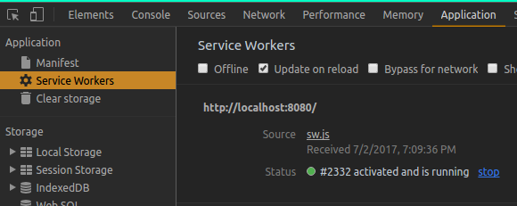

## PWA 101

## สารบัญ
- [Workbox](#workbox)

## Workbox
การสร้าง service worker จะทำหลังจากที่พัฒนาโปรเจ็กต์เสร็จและได้ทำการ build โปรเจ็กต์เสร็จเรียบร้อยแล้ว เพราะจะได้ cache ไฟล์ได้ครบถ้วนสมบูรณ์

ขั้นตอนการสร้างสร้าง sw.js<br>
/\*หมายเหตุ\*/ ให้ build โปรเจ็กต์ก่อน<br>

ติดตั้ง workbox plugin พิมพ์คำสั่ง `yarn add workbox-webpack-plugin --dev`<br>
เพิ่ม plugin ใน webpack.config.js <br>
```javascript
--- require
const workboxPlugin = require('workbox-webpack-plugin')

--- plugins
new workboxPlugin({
  globPatterns: ['**/*.{html,js,css}'],
  swDest: 'sw.js',
}),
```
จะได้ไฟล์ sw.js และ workbox-sw.prod.v1.0.1.js<br>
ให้ลบ plugin และ remove workboxPlugin ออก พิมพ์คำสั่ง `yarn remove workbox-webpack-plugin --dev`<br>
แล้วติดตั้ง plugin copy-webpack-plugin<br>
พิมพ์คำสั่ง `yarn add copy-webpack-plugin --dev`<br>
เพิ่ม plugin ใน webpack.config.js <br>
```javascript
--- require
const CopyWebpackPlugin = require('copy-webpack-plugin')

--- plugins
new CopyWebpackPlugin([
  { from: 'sw.js', to: 'sw.js' },
  { from: 'workbox-sw.prod.v1.0.1.js', to: 'workbox-sw.prod.v1.0.1.js' }
])
```

Register service worker<br>
```javascript
if ('serviceWorker' in navigator) {  
  navigator.serviceWorker.register('/sw.js').then(() => {
    console.log("OK")
  })
}
```

พิมพ์คำสั่ง `yarn dev` แล้ว inspect chrome เช็คการทำงานของ service worker<br>
