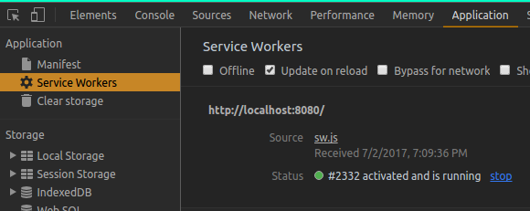

## PWA Manual
> คู่มือการใช้งาน PWA

## สารบัญ
- [Manifest](#manifest)
- [ServiceWorker](#serviceworker)

## Manifest
สำหรับ Add to home screen for Android and modern mobile browsers<br>
สร้างไฟล์ manifest.json (เก็บไว้ที่ static)<br>
```json
{
  "name": "PWA101",
  "short_name": "PWA101",
  "icons": [
    {
      "src": "/static/img/icons/android-chrome-192x192.png",
      "sizes": "192x192",
      "type": "image/png"
    },
    {
      "src": "/static/img/icons/android-chrome-512x512.png",
      "sizes": "512x512",
      "type": "image/png"
    }
  ],
  "start_url": "/index.html",
  "display": "standalone",
  "background_color": "#000000",
  "theme_color": "#4DBA87"
}
```
import เข้าไปใช้งานที่ index.html `<link rel="manifest" href="/static/manifest.json">`<br>

สำหรับ Add to home screen for Safari on iOS ให้เพิ่ม<br>
`<meta name="apple-mobile-web-app-capable" content="yes">`<br>
`<meta name="apple-mobile-web-app-status-bar-style" content="black">`<br>
`<meta name="apple-mobile-web-app-title" content="PWA101">`<br>
`<link rel="apple-touch-icon" href="/static/img/icons/apple-touch-icon-152x152.png">`<br>

สำหรับ Add to home screen for Windows ให้เพิ่ม<br>
`<meta name="msapplication-TileImage" content="/static/img/icons/msapplication-icon-144x144.png">`<br>
`<meta name="msapplication-TileColor" content="#000000">`

## ServiceWorker
การสร้าง service worker จะทำหลังจากที่พัฒนาโปรเจ็กต์เสร็จและได้ทำการ build โปรเจ็กต์เสร็จเรียบร้อยแล้ว เพราะจะได้ cache ไฟล์ได้ครบถ้วนสมบูรณ์

ขั้นตอนการสร้างสร้าง sw.js<br>
/\*หมายเหตุ\*/ ให้ build โปรเจ็กต์ก่อน<br>

ติดตั้ง workbox plugin พิมพ์คำสั่ง `yarn add workbox-webpack-plugin --dev`<br>
เพิ่ม plugin ใน webpack.config.js <br>
```javascript
--- require
const workboxPlugin = require('workbox-webpack-plugin')

--- plugins
new workboxPlugin({
  globPatterns: ['**/*.{html,js,css}'],
  swDest: 'sw.js',
}),
```
จะได้ไฟล์ sw.js และ workbox-sw.prod.v1.0.1.js<br>
ให้ลบ plugin และ remove workboxPlugin ออก พิมพ์คำสั่ง `yarn remove workbox-webpack-plugin --dev`<br>
แล้วติดตั้ง plugin copy-webpack-plugin<br>
พิมพ์คำสั่ง `yarn add copy-webpack-plugin --dev`<br>
เพิ่ม plugin ใน webpack.config.js <br>
```javascript
--- require
const CopyWebpackPlugin = require('copy-webpack-plugin')

--- plugins
new CopyWebpackPlugin([
  { from: 'sw.js', to: 'sw.js' },
  { from: 'workbox-sw.prod.v1.0.1.js', to: 'workbox-sw.prod.v1.0.1.js' }
])
```

Register service worker<br>
```javascript
if ('serviceWorker' in navigator) {  
  navigator.serviceWorker.register('/sw.js').then(() => {
    console.log("OK")
  })
}
```

พิมพ์คำสั่ง `yarn dev` แล้ว inspect chrome เช็คการทำงานของ service worker<br>
